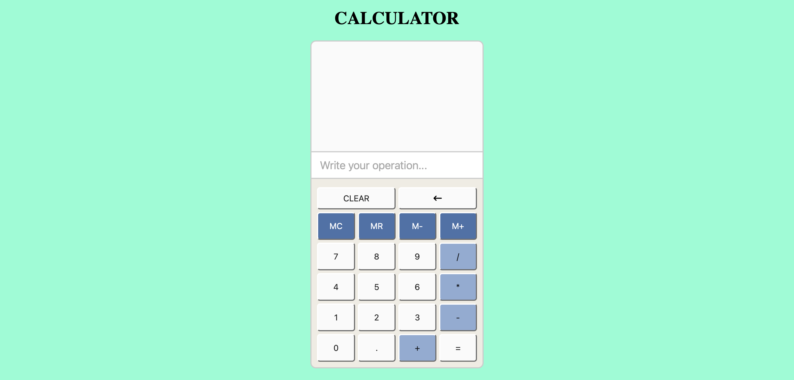

# Online Calculator

A simple and interactive online calculator built using HTML, CSS, and JavaScript. This calculator mimics a small handheld calculator and supports basic arithmetic operations. Users can also view a history of their previous calculations.
- -> Try it online: https://main.dkadwp70dcdax.amplifyapp.com/

---

## Features
- Basic arithmetic operations: Addition, Subtraction, Multiplication, Division
- Clear all button to start a new operation (CLEAR)
- Memory operations: 
    - MC = Clear calculator memory and remove results from history
    - MR, M+, M- = Currently unavailable
- History list showing previous calculations
- Simple and user-friendly interface

---

## Installation & Usage
1. git clone git@github.com:MassowNdiaye/Calculator-Challenge.git
2. open index.html 
3. Start calculating!

- -> Use it without installing: https://main.dkadwp70dcdax.amplifyapp.com/